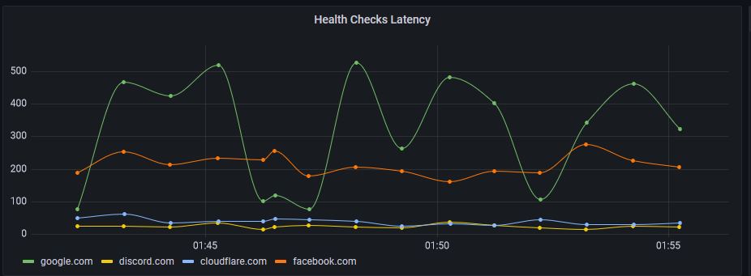
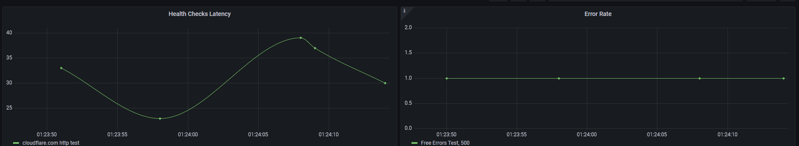

Fun example of using Cloudflare's SQLite Database, D1, with Cloudflare Analytics Engine, based on Clickhouse.





### Getting Started:

Enable D1 & AE on your account.

### Create Database:
```
wrangler d1 create worker-health-checks
```
Then, change the wrangler.toml to your database_id. Wrangler will print the entire block for you, you can just replace the existing one.

Leave the AE Sections alone, you don't need to create anything first for that.

### Setup the table structure.
```
wrangler d1 execute worker-health-checks --file=init.sql
```

### Set up some health checks. Here's a few easy ones. 
(Google ratelimits CF Workers, so we're just accepting it as valid for demo)
```
wrangler d1 execute worker-health-checks --command="Insert Into health_checks (`Name`, `Target`, `Type`) values ('facebook.com', 'https://facebook.com', 'http')"
wrangler d1 execute worker-health-checks --command="Insert Into health_checks (`Name`, `Target`, `Type`) values ('discord.com', 'https://discord.com', 'http')"
wrangler d1 execute worker-health-checks --command="Insert Into health_checks (`Name`, `Target`, `Type`, `ExpectedCodes`) values ('google.com', 'https://google.com', 'http', '200, 429')"
wrangler d1 execute worker-health-checks --command="Insert Into health_checks (`Name`, `Target`, `Type`) values ('cloudflare.com', 'https://cloudflare.com', 'http')"
```
### Full Options:
```
wrangler d1 execute worker-health-checks --command="Insert Into health_checks (`Name`, `Target`, `Type`, `Method`, `ExpectedCodes`, `ExpectedBodyContains`, `CustomHeaders`) values ('Free Errors Test', 'https://free-500.tylerobrien.dev', 'http', 'GET', '200', 'This page has returned a 500.', 'User-Agent: Cookie;Custom:Header')"
````
Fields:
```
Name = Friendly name for Grafana
Target = URL
Type = Currently, only http (not used)
Method = HTTP Method, default GET
ExpectedCode = Accepted HTTP Codes, defaults to 200, 201, 202, 203, 204, 205, 206, 207, 208, 226, 300, 301, 302, 303, 304, 305, 306, 307, 308
ExpectedBodyContains = Case-sensitive, worker will download entire response as text and check if it includes this.
CustomHeaders = Custom Request Headers. 
```
### Clear All:
```
wrangler d1 execute worker-health-checks --command='Delete from health_checks where 1=1'   
```
### Grafana Dashboard

In this repo is a default Grafana dashboard for this. Set up AE following this guide: https://developers.cloudflare.com/analytics/analytics-engine/grafana/

Then you should be able to import the WorkerHealthChecks.json dashboard. This dashboard uses & works with sampling.
### Misc.
Once you wrangler publish the project, the cron should automatically run it once per minute. Keep in mind there are sub-request limits, https://developers.cloudflare.com/workers/platform/limits/, 50/requests for bundled. This also currently is no timeout function or property, although they may be one in the future using AbortSignal.

Note that when you publish a new cron, it can take ~5-10 minutes for Cloudflare to start scheduling it. Patience is a virtue!


(Don't mind the messiness of the code, this was done in one night)


### Full Dashboard:



