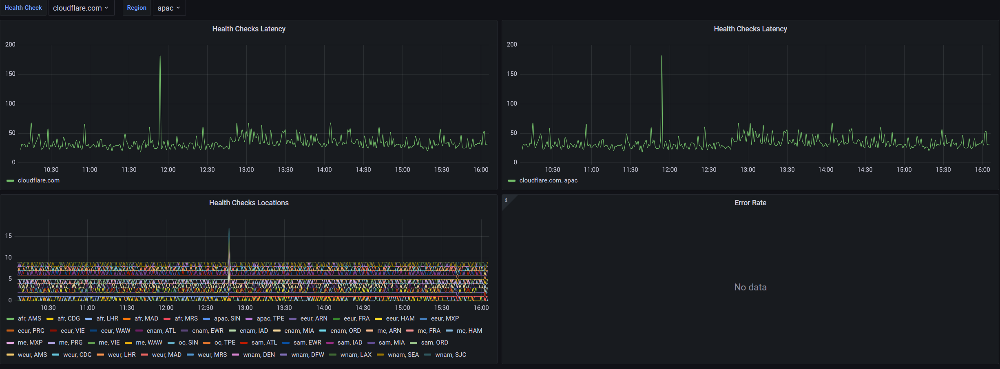

Fun example of using Cloudflare's SQLite Database, D1, with Cloudflare Analytics Engine, based on Clickhouse.

Getting Started:

Enable D1 & AE on your account.

Create Database:

wrangler d1 create worker-health-checks

Change the wrangler.toml to your database_id.

Leave the AE Sections alone, you don't need to create anything first for that.

Setup the table structure.

wrangler d1 execute worker-health-checks --file=init.sql

Set up some health checks. Here's a few for fun.

wrangler d1 execute worker-health-checks --command="Insert Into health_checks (`Name`, `Target`, `Type`) values ('facebook.com', 'https://facebook.com', 'http')"
wrangler d1 execute worker-health-checks --command="Insert Into health_checks (`Name`, `Target`, `Type`) values ('discord.com', 'https://discord.com', 'http')"
wrangler d1 execute worker-health-checks --command="Insert Into health_checks (`Name`, `Target`, `Type`, `ExpectedCodes`) values ('google.com', 'https://google.com', 'http', '200, 429')"
wrangler d1 execute worker-health-checks --command="Insert Into health_checks (`Name`, `Target`, `Type`) values ('cloudflare.com', 'https://cloudflare.com', 'http')"

Here's a fully featured one, if you want to know all of your options.

wrangler d1 execute worker-health-checks --command="Insert Into health_checks (`Name`, `Target`, `Type`, `Method`, `ExpectedCodes`, `ExpectedBodyContains`, `CustomHeaders`) values ('Free Errors Test', 'https://free-500.tylerobrien.dev', 'http', 'GET', '200', 'This page has returned a 500.', 'User-Agent: Cookie;Custom:Header')"

If you want to clear all of your health checks:

wrangler d1 execute worker-health-checks --command='Delete from health_checks where 1=1'   

In this repo is a default Grafana dashboard for this. Set up AE following this guide: https://developers.cloudflare.com/analytics/analytics-engine/grafana/

Then you should be able to import the WorkerHealthChecks.json dashboard. This dashboard uses & works with sampling and averaging.

Once you wrangler publish the project, the cron should automatically tick once per minute. Keep in mind there are sub-request limits, https://developers.cloudflare.com/workers/platform/limits/, 50/requests for bundled. This also currently is no timeout function or property, although they may be one in the future using AbortSignal.

(Don't mind the messiness of the code, this was done in one night)

Dashboard:

